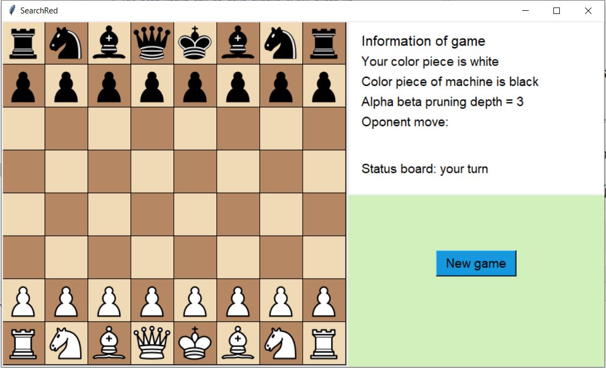
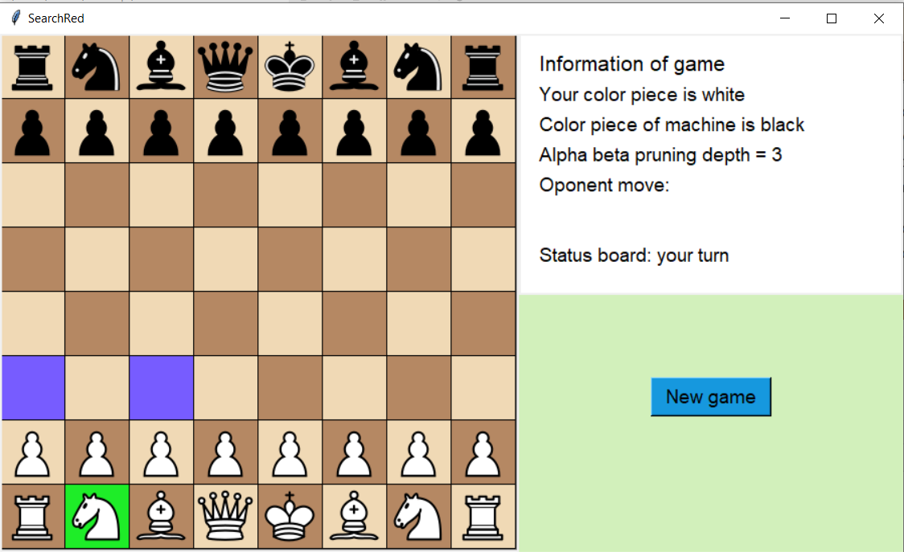
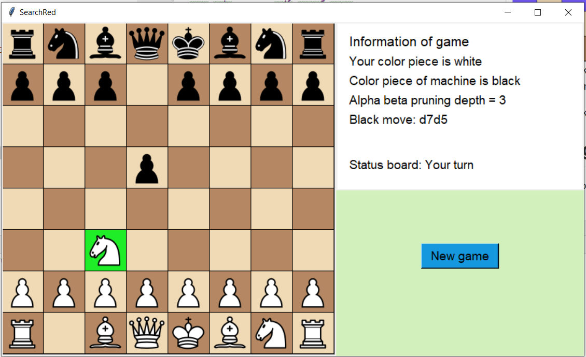
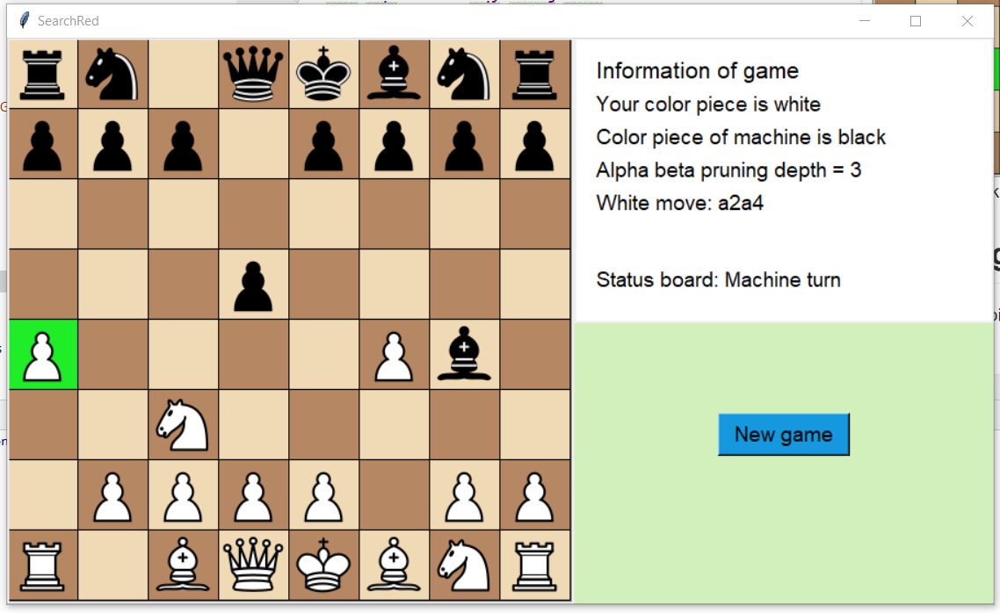
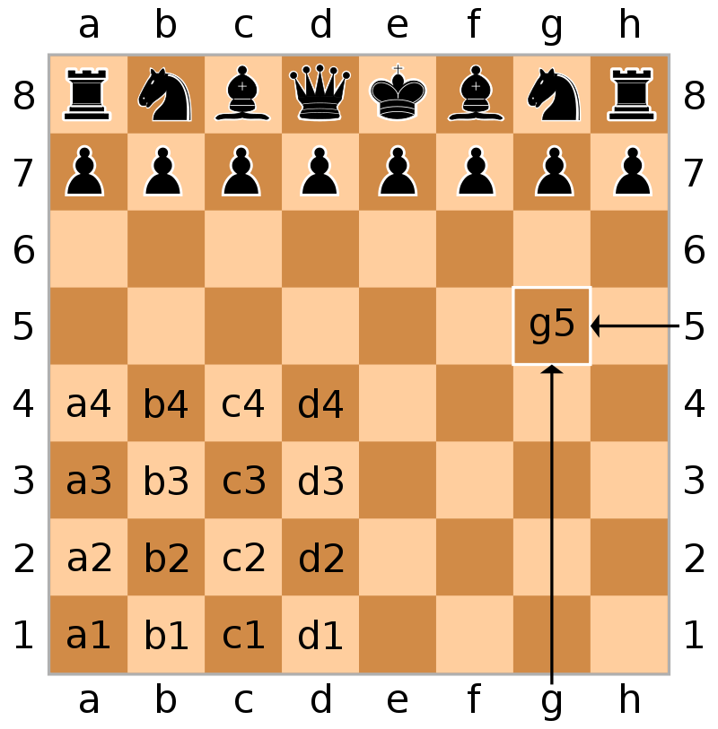

# Tài liệu hướng dẫn sử dụng chương trình chess AI
## 1. Hướng dẫn cài đặt
### Các công cục cần cài đặt bao gồm
1. [python 3.8](https://www.python.org/downloads/)
2. [IDE pychram comunity](https://www.jetbrains.com/pycharm/download/)
### Các pagkage cần cài đặt bao gồm 
1. [python-chess](https://pypi.org/project/python-chess/)  
   Trên cửa sổ terminal gõ lệnh sau: pip install python-chess
2. [Pillow](https://pypi.org/project/Pillow/)  
    Trên cửa sổ terminal trong ide gõ lệnh sau: pip install Pillow
3. [tkinter](https://tkdocs.com/tutorial/install.html)  
    Package này được cài đặt mặc định kèm theo python 3.7 rồi nên không cần chạy lệnh cài đặt  
## 2. Hướng dẫn sử dụng
###Giao diện sau khi chạy chương trình
   
 
 Chương trình có thể chạy trên các nền tảng windows, Linux, Mac  
 Khi vừa vào game thì AI chơi quân đen, còn người chơi quân trắng  
 Theo luật cờ vua thì quân trắng đi trước, do đó người chơi sẽ đánh trước và máy sẽ đánh sau  
 
   
 Người chơi click vào quân mình muốn di chuyển, và các ô màu xanh trên bàn cờ là gợi ý nước đi
   
 Người chơi click vào ô màu xanh để thực hiện di chuyển quân đến ô đó 
   
 Góc trên bên trái, phần màu trắng mô tả trạng thái bàn cờ bao gồm:  
 1. Thông tin về màu quân của người chơi
 2. Thông tin về độ sâu của thuật giải alpha beta pruning cho AI (ở đây là độ sâu mức 3)
 3. Lịch sử nước đi (ở đây quân trắng vừa đánh nước đi a2a4)
 4. Lượt chơi (ở đây đang là lượt chơi của máy)
## 4. Hướng dẫn chơi cờ vua
   Nếu bạn chưa biết chơi cờ vua có thể tham khảo link sau    
   [Rule of chess](https://en.wikipedia.org/wiki/Rules_of_chess)  
   Mô tả bàn cờ quốc tế trên máy tính như sau 
    
  Nước đi a2a4 nghĩa là quân cờ ở ô a2 di chuyển đến ô a4  